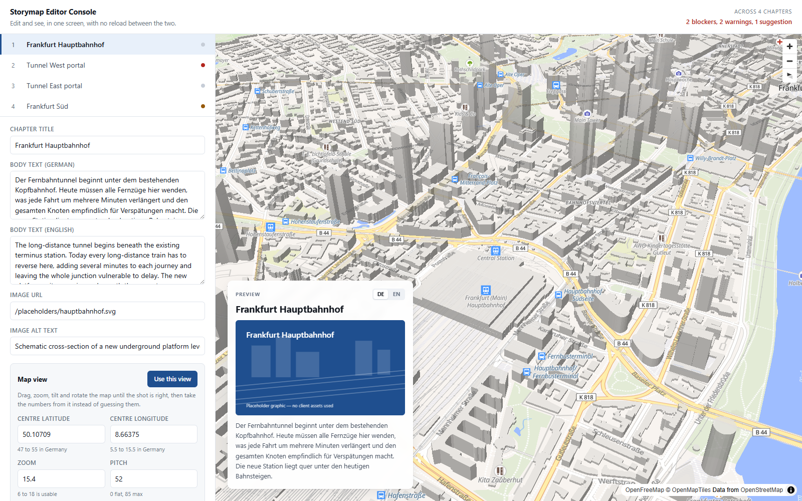
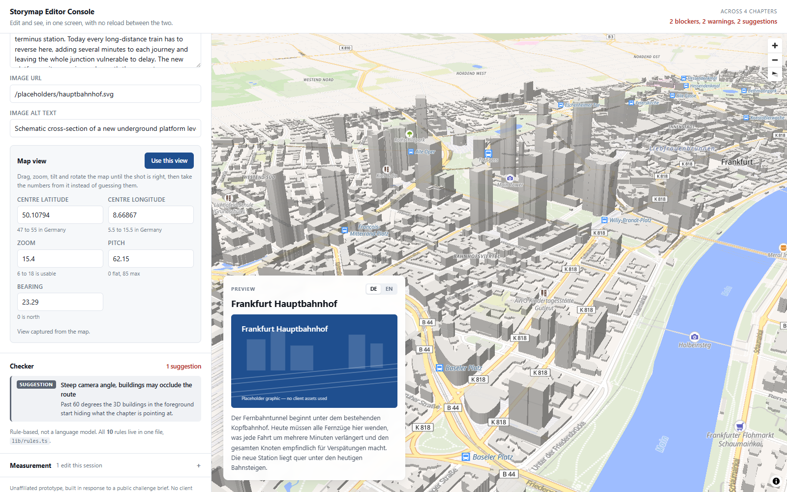

# Storymap Editor Console

A split-pane editor for map-driven story chapters. The left half is the form. The right half is
a live MapLibre preview that **never reloads**. Editing and checking happen in the same screen,
at the same time.



---

## The problem this is about

A "storymap" is an interactive page where a map fills one half of the screen and a scrolling
story fills the other — the format used to explain rail and power infrastructure projects to the
public. Each chapter of the story needs a **camera position**: centre latitude, centre longitude,
zoom, pitch and bearing.

Those five numbers are the problem. Nobody can look at `50.10709, 8.66375, 15.4, 52, 28` and know
whether it frames the right thing. So the work becomes a loop:

> type numbers → save → open the page → look → it's wrong → go back → type different numbers

And in most setups the preview reloads on every check, which throws away wherever you had scrolled
or panned to. The loop is slow, and it is slowest on exactly the part that matters most visually.

This prototype is an argument that **the loop itself is the cost**, not any individual step in it.

## What it demonstrates

**1. Nothing ever reloads.** The map instance is constructed once, on mount, and is never torn
down — there is deliberately no cleanup function in [`components/MapPreview.tsx`](components/MapPreview.tsx).
Typing in any field repaints the preview on the next keystroke. Selecting another chapter flies
the camera there. The browser never navigates.

**2. "Use this view".** Drag, zoom, tilt and rotate the map by hand until the shot looks right,
then press one button. The map's current centre, zoom, pitch and bearing are written straight into
the chapter's fields. This replaces guessing numbers with looking at them — it is the feature the
whole prototype is built around.



**3. A checker that runs as you type.** Ten rules covering the mistakes that actually happen:
coordinates outside Germany, latitude and longitude entered the wrong way round, unusable zoom
levels, camera angles steep enough to hide the route behind buildings, images without alt text,
a German chapter whose English half is empty. Each finding says what is wrong, in which field,
and one line on why it matters.


The chapter "Tunnel West portal" ships **deliberately broken** — swapped coordinates and a missing
alt text — so the checker fires the moment the page loads. Notice in the screenshot that the map
is empty: swapping the two numbers moves the camera into the Indian Ocean. That is the symptom the
rule exists to catch.

**4. Measurement, honestly.** A panel counts edits per field, edits per session, and how many
edits happened without a reload. The field somebody edits over and over is the field causing them
trouble — that is how you find the real error list instead of guessing it. There is **no
"time saved" figure**, because this prototype has not measured one, and an invented number would
be worse than no number.

## What it deliberately does not do

Being clear about the edges matters more than looking finished:

- **No CMS, no Strapi, no database, no backend.** Chapters live in [`data/chapters.json`](data/chapters.json)
  and in React state. Edits are not persisted — reload the page and you are back to the seed data.
- **No AI, and no language model of any kind.** The checker is a plain list of rules in
  [`lib/rules.ts`](lib/rules.ts). A rule-based checker that works is more credible than a fake
  intelligent one. That file is meant to be read as the beginning of an error taxonomy — the thing
  an LLM layer would sit *on top of*, not replace.
- **No real project data.** The four Frankfurt chapters use approximate public coordinates and
  entirely invented text. The images are placeholder SVGs generated for this repo.
- **No authentication, no multi-user, no undo history.**

## Running it

Requires Node.js 20 or newer.

```bash
npm install
npm run dev
```

Then open http://localhost:3000.

```bash
npm run build
npm start
```

There are no API keys and no environment variables. It runs for anyone who opens it.

### Map tiles

Tiles come from [OpenFreeMap](https://openfreemap.org) (`styles/liberty`) — free, no key required,
and it includes the 3D building data that makes the camera problem real. If that host cannot be
reached, the app falls back to MapLibre's demo style on its own and says so in the corner of the
preview; 3D buildings are not available on the fallback style.

### One piece of build machinery worth explaining

`npm run dev` and `npm run build` both run [`scripts/copy-map-worker.mjs`](scripts/copy-map-worker.mjs)
first, which copies MapLibre's web worker out of `node_modules` and into `public/`.

This is not decoration. MapLibre starts a web worker whose URL it derives from `import.meta.url`
inside its own bundled chunk. Under Next's bundler that URL does not resolve to a real file, the
server answers with the HTML app shell instead, and the worker dies on load with a MIME-type
error. The map then never finishes loading its style — no tiles, no `load` event, and a camera
that silently refuses to move. Serving the worker from a path we control and pointing MapLibre at
it with `setWorkerUrl()` removes the guesswork.

## How it is built

| | |
| --- | --- |
| Framework | Next.js 16, App Router, TypeScript |
| Map | MapLibre GL JS 6 |
| Tiles | OpenFreeMap Liberty (no API key) |
| Styling | One plain CSS file. No component library. |
| State | React `useState` in a single page component |
| Data | A local JSON file |

Roughly a dozen source files. The interesting ones:

- [`lib/rules.ts`](lib/rules.ts) — the ten rules, as data
- [`components/MapPreview.tsx`](components/MapPreview.tsx) — the map that is built once and never destroyed
- [`app/page.tsx`](app/page.tsx) — all the state, in one place

## Verified by hand

Checked in a real browser against a production build: typing repaints the card with no reload;
switching chapters flies the camera without navigating; dragging the map and pressing "Use this
view" writes the four numbers the map is actually at; the broken chapter reports two blockers on
first load and clears them live once fixed; the edit counter increments; `npm run build` completes
clean; and the console stays empty throughout.

---

## Honesty statement

This is **unaffiliated work, built in response to a public challenge brief**. It was written
without access to the organisation's code, CMS, content or data, and it uses none of their
branding, logos, client marks or copy. Every piece of text and imagery here was made for this
prototype. Any resemblance to their actual implementation is limited to what the public brief
describes.

See [NOTES.md](NOTES.md) for where the time is hypothesised to go and what the next three steps
would be.
